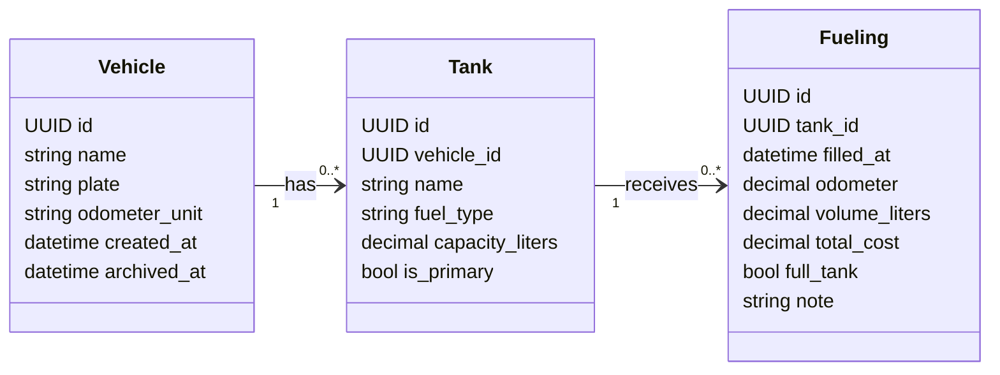

# ADR 0006 — Modelo de dados: veículos e abastecimentos

Status: Proposed  
Data: 2025-11-21

## Contexto

- A Fase 5 do projeto prevê um backend (Car Fuel API) para registrar veículos e seus abastecimentos, permitindo acompanhar consumo médio, custo por quilômetro e histórico de uso.
- A stack técnica já foi definida em `docs/adr/0005-backend-stack.md` (Java 17 + Spring Boot 3 + PostgreSQL + JPA/Hibernate).
- As diretrizes de API e erros estão em:
  - `docs/API_STYLE.md`
  - `docs/ERRORS.md`
- Os requisitos não funcionais e de observabilidade estão em:
  - `docs/NFR.md`
  - `docs/OBSERVABILITY.md`
- É necessário definir um modelo de dados coerente para:
  - representar veículos;
  - representar abastecimentos;
  - permitir cálculos de consumo e custo sem dificultar evoluções futuras (ex.: suporte a múltiplos veículos, filtros por período, tanques múltiplos e veículos flex).

## Decisão

### Entidades principais

**Veículo (`vehicle`)**

- Campos principais:
  - `id`: identificador primário (`UUID`) gerado pelo backend.
  - `name`: nome/apelido do veículo (ex.: “Corolla 2018”, “Carro da família”).
  - `plate`: placa (string opcional, única quando fornecida).
  - `odometer_unit`: unidade do hodômetro (ex.: `KM`). Para o MVP, assumimos sempre quilômetros, mas deixamos o campo preparado para evolução.
  - `created_at`: timestamp de criação do registro.
  - `archived_at`: timestamp opcional para arquivamento lógico (soft delete); `NULL` quando ativo.
- Restrições / índices:
  - Índice único em `plate` quando não nula.
  - Índice em `created_at` para consultas e ordenações.

**Tanque (`tank`)**

- Campos principais:
  - `id`: identificador primário (`UUID`).
  - `vehicle_id`: FK obrigatória para `vehicle.id`.
  - `name`: nome/apelido do tanque (ex.: “principal”, “reserva”) — opcional.
  - `fuel_type`: tipo de combustível do tanque (enum, ex.: `GASOLINE`, `ETHANOL`, `DIESEL`).
  - `capacity_liters`: capacidade nominal em litros (decimal) — opcional.
  - `is_primary`: booleano indicando se é o tanque principal do veículo.
- Restrições / índices:
  - FK `vehicle_id` referenciando `vehicle.id` com `ON DELETE RESTRICT`.
  - Índice composto `(vehicle_id, is_primary)` para identificação rápida do tanque principal.

**Abastecimento (`fueling`)**

- Campos principais:
  - `id`: identificador primário (`UUID`).
  - `tank_id`: FK obrigatória para `tank.id`.
  - `filled_at`: data/hora do abastecimento (timestamp com fuso).
  - `odometer`: leitura do hodômetro no momento do abastecimento (decimal, em `odometer_unit`, normalmente km).
  - `volume_liters`: volume abastecido em litros (decimal, precisão adequada para consumo médio).
  - `total_cost`: custo total do abastecimento na moeda local (decimal).
  - `full_tank`: booleano indicando se o tanque foi completado (true/false).
  - `note`: campo de observação opcional (texto curto).
- Restrições / índices:
  - FK `tank_id` referenciando `tank.id` com `ON DELETE RESTRICT`.
  - Índice composto `(tank_id, filled_at)` para consultas por período.
  - Índice composto `(tank_id, odometer)` para cálculos de consumo baseados em hodômetro.

### Cálculos e derivados

- Cálculos como consumo médio (`km/l`) e custo por quilômetro **não são armazenados** como campos fixos; serão derivados a partir de:
  - diferenças de hodômetro entre abastecimentos consecutivos;
  - `volume_liters` e `total_cost`.
- O uso de `full_tank` permite, em versões futuras, aplicar algoritmos de consumo que consideram apenas sequências entre tanques cheios.
- O relacionamento via `tank` permite cálculos por tanque (ex.: tanque gasolina vs. tanque etanol) e agregação por veículo (`fueling` → `tank` → `vehicle`).

### Considerações de privacidade e dados sensíveis

- Não armazenamos dados pessoais de condutores; foco apenas em informações do veículo, tanques e abastecimentos.
- Para o MVP, não registramos localização precisa (GPS) nem dados de posto; `note` pode conter observações livres, mas recomenda-se evitar PII — alinhado com `docs/PRIVACY.md`.

## Consequências

Pontos positivos:

- Modelo simples, com três entidades centrais (`vehicle`, `tank` e `fueling`), fácil de mapear com JPA/Hibernate.
- Facilita consultas comuns:
  - histórico de abastecimentos por veículo;
  - histórico de abastecimentos por tanque (útil para veículos flex);
  - cálculo de consumo médio por período;
  - custo acumulado por veículo ou por tipo de combustível (via `tank.fuel_type`).
- Compatível com a stack técnica definida no ADR 0005 (PostgreSQL + Spring Data JPA).
- Soft delete em `vehicle` (`archived_at`) permite ocultar veículos antigos sem quebrar histórico de abastecimentos.

Pontos negativos / trade-offs:

- Modelo levemente mais complexo do que a versão de duas tabelas; consultas para consumo por veículo exigem join `fueling` → `tank` → `vehicle`.
- A ausência de campos derivados (ex.: consumo calculado e armazenado) pode exigir consultas um pouco mais pesadas para dashboards, embora aceitável para o volume previsto inicialmente (ver `docs/NFR.md`).
- O campo `note` é pouco estruturado; qualquer uso mais avançado (tags, categorias) exigirá extensões futuras.

Impactos:

- O contrato OpenAPI (issue #131) deverá refletir esse modelo:
  - recursos `/vehicles`, `/tanks` e `/fuelings` com os campos definidos acima;
  - payloads de criação/listagem compatíveis (por exemplo, abastecimentos referenciam `tank_id`).
- Migrações de banco (scripts/`schema.sql` ou ferramentas de migração) devem criar essas tabelas, índices e FKs.
- A lógica de domínio que calcula consumo e estatísticas deve usar exclusivamente esse modelo como fonte de verdade.

## Alternativas consideradas

- **Armazenar abastecimentos embutidos no documento de veículo (modelo mais “documento”)**
  - Prós:
    - Consulta de um veículo já traria todo o histórico em uma estrutura única.
  - Contras:
    - Pouco alinhado com o uso de PostgreSQL relacional.
    - Históricos longos tornariam o registro de veículo grande e mais difícil de paginar/consultar.

- **Criar uma tabela adicional de métricas agregadas (ex.: `vehicle_stats`)**
  - Prós:
    - Consultas de dashboard mais rápidas (já usando dados pré-agregados).
  - Contras:
    - Complica o MVP com concerns de sincronização (manter estatísticas consistentes com cada novo abastecimento).
    - Melhor ser avaliado em ADR futuro, quando houver necessidade real de otimização.

## Relacionados

- Issues: #130
- PRs: _(definido pela PR que introduzir este ADR)_
- Outros ADRs:
  - `docs/adr/0005-backend-stack.md`
  - `docs/adr/0002-api-style-and-errors.md`
  - `docs/adr/0003-nfrs-and-observability.md`
  - `docs/adr/0004-security-privacy-environments.md`
