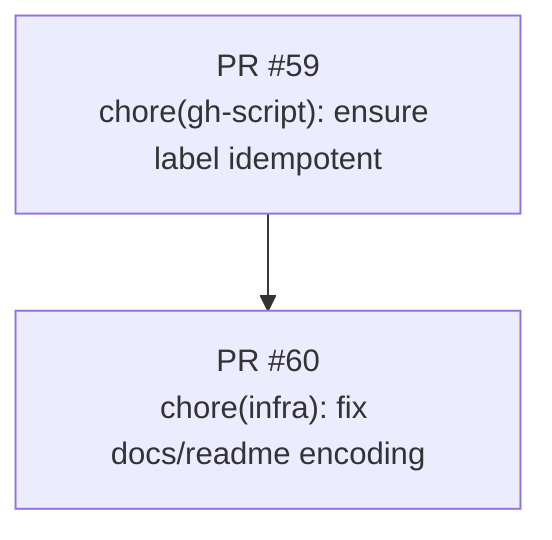

# Stack PR — Visualização da Pilha

Este arquivo é atualizado automaticamente para refletir as PRs abertas e suas dependências (base → head) como um diagrama Mermaid. Edite apenas as seções fora dos marcadores se necessário.

<!-- stack-pr:begin -->

<!-- stack-pr:end -->

## Notas
- A cadeia é inferida quando a `base` de uma PR é exatamente o `head` de outra PR (PRs empilhadas).
- Mantenha no corpo das PRs: `Depends on #<PR>` para ajudar a navegação.
- Ordem de merge: base → topo da pilha; usar "Squash and merge".

